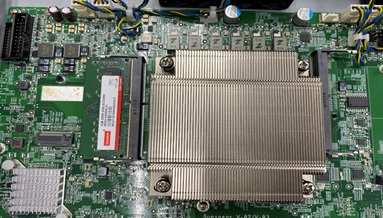

# Image Classification of Misaligned Heat Sink
### Objective
To design the CNN-based deep neural network (DNN) to infer the presence of misaligned heat sink in the device under test   
### Heat Sink Images   
**PASS: Algined Heat Sink**   
   
**FAIL: Misalgined Heat Sink**   
   

### Architecture of VGG16 Model      
   
### Proposed Model   
   
#### [Fine-tuning Steps](https://www.pyimagesearch.com/2019/06/03/fine-tuning-with-keras-and-deep-learning/)
1. Remove the fully connected nodes at the end of the network (i.e., where the actual class label predictions are made).
2. Include the global average pooling layer to summarize the learned features of the previous CNN layers
3. Replace the two fully connected nodes of VGG16 model with two 512-node hidden layers and a two-node output layer with the softmax classifier.
5. Freeze the CONV layers earlier in the network (ensuring that any previous robust features learned by the CNN are not destroyed).
6. Start training, but only train the FC layer heads.
7. Optionally unfreeze some/all of the CONV layers in the network and perform a second pass of training.
8. Distribute the network training using the [Keras MirroredStrategy API](https://www.tensorflow.org/tutorials/distribute/keras) for in-graph replication with synchronous training on two GPUs
9. Compile the model with the adam optimizer, sparse categorical crossentropy loss, and accuracy metric
10. Define the callbacks for saving the model with the maximum accuracy and for logging the events with Tensorboard
11. Train the model on the desired number of epochs (or iterations) over the training batches
12. Plot the loss and accuracy across the training and validation epochs
13. Repeat steps 3-12 by varying the number of hidden nodes in the fully connected network, optimization algorithm and parameters, activation function, and preprocessing methods
### Data Acquisition   
1. Used the python script capture_image.py to capture the webcam images   
2. Labeled the two output classes to be classifed by the proposed model as: 0-FAIL (Misaligned or no heat sink), 1-PASS (Correctly aligned heat sink)
3. Captured the webcam images with the following experimental setup
#### Experimental Setup
   
4. Collected 1518 images for each class

### Preprocessing
1. Convert the color space of the image from BGR to RGB
2. Resize the image to 224 x 224 
3. Subtract the per-channel mean of the imagenet dataset (RGB:[123.68, 116.779, 103.939]) from the resized image   

**Input Image (PASS)**   
Dimensions: 640 x 480   
   

**Preprocessed Image (PASS)**   
Dimensions: 224 x 224   
   

**Input Image (FAIL)**   
Dimensions: 640 x 480   
   

**Preprocessed Image (FAIL)**   
Dimensions: 224 x 224   
   

### Training   
1. Maximum training epochs = 100   
2. Save the model after each epoch in the ModelCheckPoint and set patience = 30 in the EarlyStopping
3. Execution Time: 3.76 m, Epochs: 35

#### Performance   


### Prediction    
1. Capture the webcam image   
2. Change the color space from BGR into RGB   
3. Resize the image into the dimensions of 224 x 224   
4. Subtract the per-channel mean from the resized image   
5. Predict the output class of the image with the trained model   

```
python3 predict.py
```
#### Sample Output  
   

## Training Platform Setup
### Training Platform
OS: Ubuntu 16.04
Kernel: 4.16.0-041600-generic   
Memory: 32 GB   
CPU: Intel® Core™ i7-8700K CPU @ 3.70GHz × 12   
GPU: GeForce GTX 1080 x 2   

### Prerequisites
1. Remove the previous installations of NVIDIA driver, CUDA toolkit and cuDNN libraries
```
sudo apt purge --remove '^nvidia'
sudo apt purge --remove '^cuda'
sudo apt-get clean && apt-get autoremove
dpkg --configure -a
rm -rf /usr/local/cuda*
sudo apt-get upgrade
sudo apt-get update
```
2. Check the [dependenices to install Tensorflow 2.4.0](https://www.tensorflow.org/install/gpu) with GPU support
3. Install Python 3.8
```
sudo add-apt-repository ppa:deadsnakes/ppa
sudo apt update
sudo apt install python3.8 python3.8-dev python3.8-venv
sudo update-alternatives --install /usr/bin/python3 python3 /usr/bin/python3.5 1
sudo update-alternatives --install /usr/bin/python3 python3 /usr/bin/python3.8 2
sudo update-alternatives --config python3
python3 -m pip install --upgrade pip
pip3 install -U virtualenv
```
4. [Update the gcc and g++](https://gist.github.com/jlblancoc/99521194aba975286c80f93e47966dc5) modules to the latest version
```
sudo apt-get install -y software-properties-common python-software-properties
sudo add-apt-repository ppa:ubuntu-toolchain-r/test
sudo apt update
sudo apt install g++-7 -y
sudo update-alternatives \
    --install /usr/bin/gcc gcc /usr/bin/gcc-7 60 \
    --slave /usr/bin/gcc-ar gcc-ar /usr/bin/gcc-ar-7 \
    --slave /usr/bin/gcc-nm gcc-nm /usr/bin/gcc-nm-7 \
    --slave /usr/bin/gcc-ranlib gcc-ranlib /usr/bin/gcc-ranlib-7 \   
    --slave /usr/bin/g++ g++ /usr/bin/g++-7
```
Update the sym link gcc in /etc/alternatives
```
rm /etc/alternatives/gcc
sudo ln -s /usr/bin/gcc-7 /etc/alternatives/gcc
sudo ln -s /usr/bin/g++-7 /etc/alternatives/g++
```
Verify the installed gcc version
   
### Installation of CUDA Toolkit and NVIDIA Driver

**Note**: The NVIDIA driver is installed as part of the CUDA Toolkit. There is no need of prior installation of the NVIDIA driver. If installed, remove the previous version

#### [Installation Steps](https://developer.nvidia.com/cuda-11.0-download-archive?target_os=Linux&target_arch=x86_64&target_distro=Ubuntu&target_version=1604&target_type=deblocal)

1. Open a new console by pressing Ctrl+Alt+F1. Stop the display manager service to stop the X server
```
sudo service lightdm stop
```
2. Set the run level to VGA
```
sudo init 3
```
3. Set the environment variable CC to point to the gcc path
```
export CC=/usr/bin/gcc-7
```
4. Install CUDA toolkit and NVIDIA driver
```
wget https://developer.download.nvidia.com/compute/cuda/repos/ubuntu1604/x86_64/cuda-ubuntu1604.pin
sudo mv cuda-ubuntu1604.pin /etc/apt/preferences.d/cuda-repository-pin-600
wget http://developer.download.nvidia.com/compute/cuda/11.0.2/local_installers/cuda-repo-ubuntu1604-11-0-local_11.0.2-450.51.05-1_amd64.deb
sudo dpkg -i cuda-repo-ubuntu1604-11-0-local_11.0.2-450.51.05-1_amd64.deb
sudo apt-key add /var/cuda-repo-ubuntu1604-11-0-local/7fa2af80.pub
sudo apt-get update
sudo apt-get -y install cuda
```
Add the installation path of CUDA toolkit to the PATH variable in ~/.bashrc 
```
export PATH=$PATH:/usr/local/cuda/bin/
```
Update the bashrc file
```
source ~/.bashrc
```

5. Reboot the machine to verify the installation of driver and CUDA

**Verification of CUDA 11.0 Toolkit installation**   
   
**Verification of NVIDIA driver installation**


**Verification of the interaction between CUDA toolkit and GPUs**

Build the CUDA samples after configuring the g++ compiler
```
cd /usr/local/cuda/samples/
make
```
Execute the CUDA application 
```
./bin/x86_64/linux/release/deviceQuery
```


### [Installation of cuDNN Libraries](https://docs.nvidia.com/deeplearning/cudnn/install-guide/index.html)

1. [Download the debian files of the cuDNN libraries](https://developer.nvidia.com/cudnn-download-survey) 

2. Install the runtime library
```
dpkg -i libcudnn8_8.0.5.39-1+cuda11.0_amd64.deb
```

3. Install the developer library
```
dpkg -i libcudnn8-dev_8.0.5.39-1+cuda11.0_amd64.deb
```

4. Install the code samples and the cuDNN library documentation
```
dpkg -i libcudnn8-samples_8.0.5.39-1+Installation of Tensorflow 2.4.0cuda11.0_amd64.deb
```

5. Verification of cuDNN application
```
cd /home/test/Documents/DeepLearning/Classification/AOI/cuDNN
cp -r /usr/src/cudnn_samples_v8/ ./
make clean && make
./mnistCUDNN
```
**Result**


### Installation of Tensorflow 2.4.0

1. Create the Python virutal environment
```
cd /home/test/Documents/DeepLearning
mkdir venv_tf
python3 -m venv ./venv_tf/
source ./venv_tf/bin/activate
```
2. Upgrade the pip version
python3 -m pip install --upgrade pip

3. Install Tensorflow
pip3 install tensorflow

4. Update the path of python.exe in the virtual environment to the Eclipse IDE

### Errors and Workaround

#### Error
```
dpkg: error processing archive /var/cache/apt/archives/cuda-repo-ubuntu1604-10-0-local-10.0.130-410.48_1.0-1_amd64.deb
```
#### Workaround
```
sudo dpkg -i --force-overwrite /var/cache/apt/archives/cuda*
```
